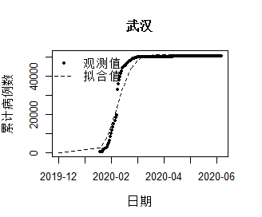

## 3. 基于极大似然估计SEIR模型参数

### <font size=6>**3.1 SEIR模型**</font>

### <font size=6>**3.2 全国疫情分析**</font>

### <font size=6>**3.3 湖北地区疫情分析**</font>

### <font size=6>**3.4 全国除湖北外疫情分析**</font>

### <font size=6>**3.5 武汉外疫情分析**</font>

### <font size=6>**3.6 疫情比较**</font>

## **3.4 全国除湖北外疫情分析**
根据上述 SEIR 微分方程模型，采用极大似然估计，并结合 Nelder-Mead 最优算法，得出全国除湖北以外地区疫情的参数估计结果：


参数|$\beta$|$k$|$\sigma$|$\gamma$|$R_0$|$R_t$
:-:|:-:|:-:|:-:|:-:|:-:|:-:
|估计值|0.644|0.108|0.162|0.160|4.017|$4.017e^{-0.108t}$|

## **3.4 全国除湖北外疫情分析——有效再生数**
从表中可以看出，全国除湖北以外地区疫情的有效再生数$R_t$是呈指数不断下降趋势的，其有效再生数下降达到1以下的日期是2月6日，这表明自2020年2月6日起,疫情已经处于受控状态.如图所示，在SEIR模型下，控制干预措施对全国除湖北以外地区疫情的抑制是成功有效的。

```{r, fig.show = "hold", out.width = "50%", out.height= "20%", fig.align = "center",echo=FALSE}

```

## **3.4 全国除湖北外疫情分析——新增病例数拟合**
2020年2月5日,理论当日新增确诊人数达到峰值,随后开始逐日下降。因此,理论拐点已在2020年2月5日出现。而实际的当时新增确诊人数也是从2月5日开始有下降趋势的。

```{r, fig.show = "hold", out.width = "50%", out.height= "20%", fig.align = "center",echo=FALSE}

```

## **3.4 全国除湖北外疫情分析——累计病例数拟合 **
通过上述重要参数的估计及分析计算累计人数的拟合值，并作图与真实观测值进行对比拟合。可以看出全国除湖北以外地区疫情的真实观测值与拟合值的发展趋势基本一致，拟合曲线基本吻合，这表明SEIR模型对新冠疫情的传播机制和传播速度能够给出有效的解释和说明。

```{r, fig.show = "hold", out.width = "50%", out.height= "20%", fig.align = "center",echo=FALSE}

```

## **3.5 武汉疫情分析**
同上文分析一样，通过 SEIR 微分方程模型，采用极大似然估计，并结合 Nelder-Mead 最优算法，得出武汉地区疫情的参数估计结果：


参数|$\beta_0$|$k$|$\sigma$|$\gamma$|$R_0$|$R_t$
:-:|:-:|:-:|:-:|:-:|:-:|:-:
估计值|0.644|0.051|0.225|0.206|3.128|$3.128e^{-0.051t}$|

## **3.5 武汉疫情分析——有效再生数**
全国除湖北以外地区疫情的有效再生数$R_t$是呈指数不断下降趋势的，其有效再生数下降达到1以下的日期是2月15日，这表明自2020年2月15日起,疫情已经处于受控状态.在SEIR模型下，控制干预措施对全国除湖北以外地区疫情的抑制是成功有效的。

```{r, fig.show = "hold", out.width = "50%", out.height= "20%", fig.align = "center",echo=FALSE}
knitr::include_graphics("plot/Rplot4.png")
```

## **3.5 武汉疫情分析——新增病例数拟合**
2020年2月23日,理论当日新增确诊人数达到峰值,随后开始逐日下降。因此,理论拐点已在2020年2月23日左右出现。而实际的当时新增确诊人数也是从2月20日左右开始有下降趋势的。

```{r, fig.show = "hold", out.width = "50%", out.height= "20%", fig.align = "center",echo=FALSE}

```

## **3.5 武汉疫情分析——累计病例数拟合**
通过上述重要参数的估计及分析对累计人数的拟合值，并作图与真实观测值进行对比拟合。可以看出全国除湖北以外地区疫情的真实观测值与拟合值的发展趋势基本一致，拟合曲线基本吻合，这表明SEIR模型对新冠疫情的传播机制和传播速度能够给出有效的解释和说明。

```{r, fig.show = "hold", out.width = "50%", out.height= "20%", fig.align = "center",echo=FALSE}

```

## **3.6 对比分析**

新冠疫情|$\sigma$|$\gamma$|$\beta_0$|$k$|$R_0$|$R_t$
:-:|:-:|:-:|:-:|:-:|:-:|:-:
武汉|0.225|0.206|0.644|0.051|3.128|$3.128e^{-0.051t}$|
湖北|0.210|0.148|0.591|0.062|3.982|$3.982e^{-0.062t}$|
全国除湖北地区|0.162|0.160|0.644|0.108|4.017|$4.017e^{-0.108t}$|
全国|0.201|0.142|0.617|0.072|4.344|$4.344e^{-0.072t}$|

